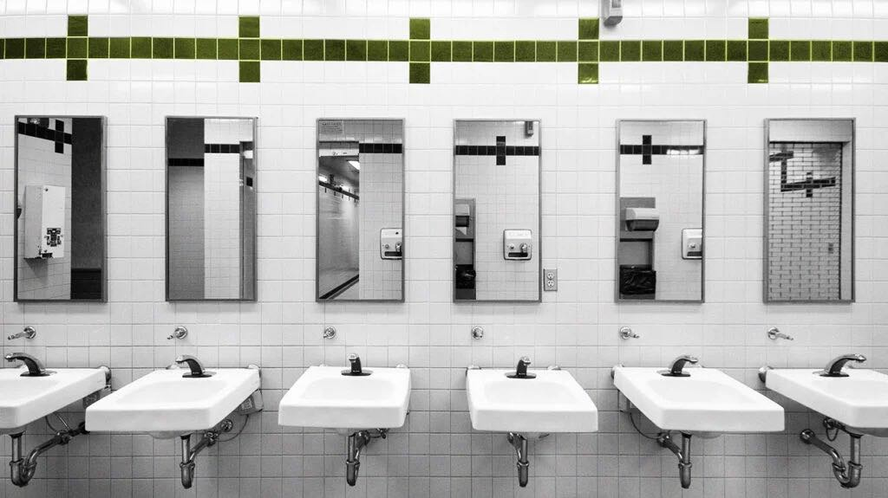

*Carie Wu (uni: kw3104 ), Rita Wang (uni: ryw2109), Megan Panier (uni: map2365), Minghe Wang (uni: mw3845) and Huiyan Ni(uni: hn2453)*

## Motivation 

Any New Yorker knows the struggle of needing to find a restroom while on the go. We've all had that moment of hesitation
before enjoying a large coffee, wondering if we'll make it to the next stop in time. For subway riders, this challenge 
is amplified by the limited availability of accessible and operational restrooms near stations—a vital service for 
millions of commuters. Inspired by this shared experience, our project focuses on analyzing restroom accessibility 
across the NYC subway system. By analyzing public restroom data and subway station characteristics, we aim to uncover 
trends, highlight underserved areas, and offer data-driven recommendations to enhance this essential infrastructure for 
all, particularly individuals with disabilities and families.

## Related Work

We were inspired to perform this analysis after discovering public restroom and subway entrance datasets available 
through [NYC Open Data](https://data.cityofnewyork.us/City-Government/Public-Restrooms/i7jb-7jku/about_data). These data
provide detailed information about restroom accessibility, operational status, and geographic locations, as well as 
subway station characteristics like entrance type and staffing. Given the significant role public restrooms play in 
urban life—particularly for families, individuals with disabilities, and commuters—we saw an opportunity to explore 
accessibility disparities across NYC’s subway system. The richness of the data, including spatial coordinates for 
restrooms and stations, allowed us to integrate geospatial analysis, predictive modeling, and interactive mapping, 
making it an excellent fit for the visualization and analysis techniques discussed in class.

## Initial Questions 

Some of our initial questions included:

*Which subway stations have accessible restrooms nearby?*

*Are accessible restrooms distributed evenely accross the city?*

*What are some of the factors that are associated with restroom availability?*

As our project developed, we also considered:

*How does proximity to subway entrances with ADA features, such as ramps or elevators, influence restroom accessibility?*

*How does restroom availability correlate with operational hours or staffing levels?*

To further understand the accessibility landscape of NYC subway stations, we employed the k-modes clustering 
algorithm to categorize stations into three distinct accessibility levels based on key features such as ADA 
compliance, free crossover availability, and restroom accessibility metrics. Given the categorical nature of our data, 
k-modes was particularly suitable as it effectively handles non-numeric variables by minimizing the dissimilarity based 
on the modes of clusters. Prior to clustering, we meticulously preprocessed the dataset by addressing missing values and
ensuring that variables like `restroom_changing_stations`, `restroom_status`, `restroom_accessibility`, and 
`restroom_open` were appropriately formatted for the analysis. The clustering results revealed that 
`restroom_accessibility` plays a significant role in determining the overall accessibility levels of stations. 
Specifically, high-accessibility stations predominantly feature fully accessible restrooms, whereas medium- and 
low-accessibility stations often lack such amenities or have incomplete restroom accessibility data. This finding was 
supported by our post-clustering analysis, which indicated a strong association between restroom accessibility and 
cluster assignments. Additionally, the uneven distribution of categorical variables across clusters was evident, which 
likely influenced the uniformity of dominant features within each cluster. These formal statistical analyses not only 
validated our initial observations but also highlighted the critical areas where improvements are needed to enhance the 
accessibility of NYC’s subway system.

